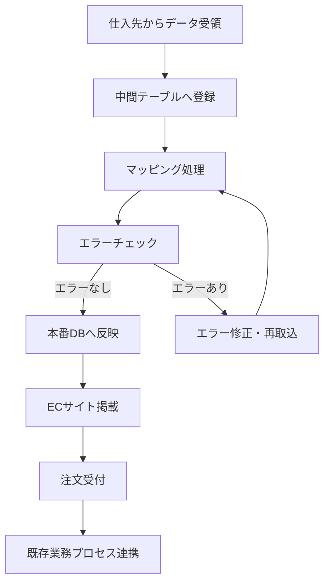

# システムギア様向けECサイト機能拡張 詳細要件定義

---

## 【要約】全体整合性チェックとSTEP1見積もり

- 本要件定義・設計・画面・API設計は、STEP1（外部在庫取込の基本機能）にフォーカスし、業務フロー・システム構成・画面・API・マッピング機能が一貫して整合しています。
- 画面設計・API設計も要件・業務フローと齟齬なく、マッピング機能の仕様も運用・拡張性・バリデーションまで要件に合致しています。
- 見積もりはSTEP1のみ（データ取込・マッピング・バッチ・基本画面）で明確化しています。

| ステップ | 工数（人日） | 費用（万円） | 内容 |
|----------|-------------|-------------|------|
| STEP1    | 30          | 180         | データ取込・マッピング・バッチ・基本画面 |

---

## 1. 背景・目的
- 既存ECサイト（osCommerceベース）の機能拡張。
- 仕入先（A2Global等）からの在庫・価格データを自社ECに取り込み、商品点数・売上拡大を目指す。
- スモールスタート・低コスト運用・段階的拡張が前提。

## 2. 業務要件
### 2.1. 取り寄せ在庫業務フロー

### 2.2. データフロー
- 仕入先ごとに異なる在庫・価格データを受領（メール/FTP等）
- 中間テーブルへ統一フォーマットで格納
- マッピングルールに従い本番DBへ反映
- エラー時は手動修正・再取込
- ECサイトに在庫・価格情報を掲載

### 2.3. 運用要件
- 取込データのサイクル（例：日次/週次）
- データ精度・納期遵守率の管理
- エラー発生時のアラート・通知
- 仕入先ごとの信用度・サポート品質も考慮

## 3. システム要件
### 3.1. 機能要件
#### 3.1.1. データ取込・マッピング
- 仕入先ごとに異なるデータフォーマットを中間テーブルに統一
- マッピングルール設定機能（項目名・型・一致条件・固定値等）
- 取込管理No.によるバッチ処理・過去データの自動削除

#### 3.1.2. エラー処理
- 取込時のエラーデータ抽出・手動修正・再取込
- 将来的には自動化も視野

#### 3.1.3. 商品・在庫・価格管理
- 商品マスタ、仕入先在庫・単価・型番マスタ、中間テーブル（受領データ一時格納用）
- 既存テーブル（products, products_description, categories_description, manufacturers, ...）との連携

#### 3.1.4. 画面・機能
- 商品検索・詳細・新規登録・更新
- マッピング設定画面
- 仕入先型番メンテナンス
- エラー一覧・修正・再取込

### 3.2. 非機能要件
- パフォーマンス：日次/週次バッチで数万件規模のデータ処理に耐える
- セキュリティ：仕入先データの安全な受領・管理
- 可用性：クラウド（AWS）前提、障害時のリカバリ設計
- 保守性：マッピングルールや仕入先追加の容易さ

### 3.3. システム構成
- サーバ：AWS等クラウド（Linux）
- DB：PostgreSQL（Aurora/RDS）
- バックエンド：Java（SpringBoot）
- フロントエンド：Vue.js（HTML5/CSS3/JS）

### 3.4. ステップ開発
- STEP1：外部在庫取込の基本機能
- STEP2：機能拡張（多仕入先対応・自動化等）
- STEP3：UI/UX改善

## 4. DB設計（抜粋）
- products, products_description, categories_description, manufacturers, manufacturers_list, manufacturers_status
- 新規：仕入先在庫・単価・型番マスタ、中間テーブル
- 詳細はdetailed_requirements_definition.md参照

## 5. 見積もり（例：概算）
| ステップ | 工数（人日） | 費用（万円） | 内容 |
|----------|-------------|-------------|------|
| STEP1    | 30          | 180         | データ取込・マッピング・バッチ・基本画面 |

※要件・規模により変動。詳細は個別見積もり。

---

## 6. 補足・今後の検討
- 仕入先追加時のマッピングテンプレート化
- エラー自動修正・AI活用の可能性
- 既存システムとのAPI連携強化
- 運用マニュアル・教育支援 