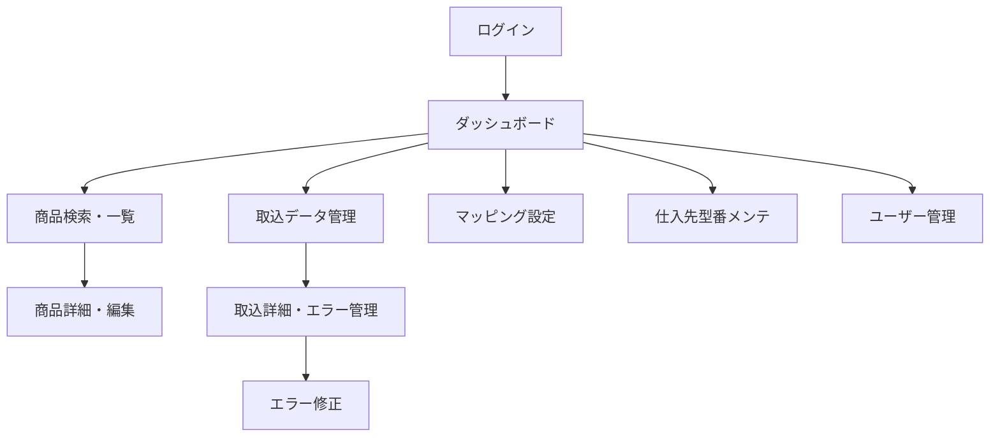

# システムギア様向けECサイト機能拡張 詳細画面設計・マッピング機能仕様

---

## 1. 画面設計（主要画面）

### 1.1. ログイン画面
- 管理者/担当者認証
- パスワードリセット機能

### 1.2. ダッシュボード
- 取込状況サマリ（最新バッチ状況、エラー件数、仕入先別状況）
- アラート・通知表示

### 1.3. 商品検索・一覧画面
- 商品名/型番/仕入先/在庫/価格等で検索
- 検索結果一覧（ページング、ソート、CSV出力）
- 商品詳細リンク

### 1.4. 商品詳細・編集画面
- 商品基本情報（ID、型番、名称、在庫、価格、仕入先情報等）
- 編集・保存・削除
- 変更履歴表示

### 1.5. 取込データ管理画面
- 取込履歴一覧（バッチNo、仕入先、取込日時、件数、エラー数）
- 取込ファイルダウンロード
- 詳細（エラー内容、再取込ボタン）

### 1.6. エラー管理・修正画面
- エラー一覧（項目別、仕入先別、エラー内容）
- エラー内容編集・修正・再取込
- エラー履歴管理

### 1.7. マッピング設定画面
- 仕入先ごとにマッピングルールを設定・編集
- 項目名、型、変換条件、一致条件、固定値、バリデーション設定
- サンプルデータプレビュー
- ルールのインポート/エクスポート

### 1.8. 仕入先型番メンテナンス画面
- 仕入先型番と自社型番の紐付け管理
- 一括登録・編集・削除
- 履歴管理

### 1.9. ユーザー管理画面
- ユーザー追加・編集・権限設定
- ログイン履歴

---

## 2. 画面遷移イメージ

---

## 3. マッピング機能 仕様詳細

### 3.1. 概要
- 仕入先ごとに異なるデータフォーマットを自社DB項目にマッピング
- マッピングルールはGUIで設定・編集可能
- ルールはバッチ処理時に適用

### 3.2. マッピング設定項目
| 設定項目 | 内容 |
|----------|------|
| 仕入先 | 対象仕入先の選択 |
| 取込ファイル項目 | 仕入先データのカラム名 |
| 自社DB項目 | マッピング先DBカラム名 |
| 型変換 | 文字列→数値、日付等の型変換ルール |
| 一致条件 | 値の一致・部分一致・範囲等の条件指定 |
| 固定値 | 常に特定値をセットする場合の設定 |
| バリデーション | 必須/型/範囲/正規表現等の入力チェック |
| 計算式 | 四則演算・文字列連結等の簡易計算 |
| 優先度 | 複数ルールが該当する場合の優先順位 |

### 3.3. マッピング設定UI要件
- 仕入先ごとにルール一覧表示・編集
- 新規ルール追加・複製・削除
- サンプルデータを使ったプレビュー
- ルールのインポート/エクスポート（CSV/JSON）
- 変更履歴管理

### 3.4. 運用フロー
1. 管理者が新規仕入先追加時にマッピングルールを作成
2. 取込バッチ実行時にルールを適用
3. エラー発生時はルール修正・再取込
4. ルール変更は履歴管理し、ロールバック可能

### 3.5. バリデーション・拡張性
- 必須項目・型・範囲・正規表現等のバリデーション
- 仕入先追加時のテンプレート化
- 将来的なAI自動マッピング補助も視野

---

## 4. 補足
- 画面デザインはVue.jsベースの管理画面UIフレームワーク（Vuetify等）を想定
- マッピングルールはDBで管理し、API経由でバッチ・画面双方から利用
- 画面設計詳細（ワイヤーフレーム等）は別途作成可能 