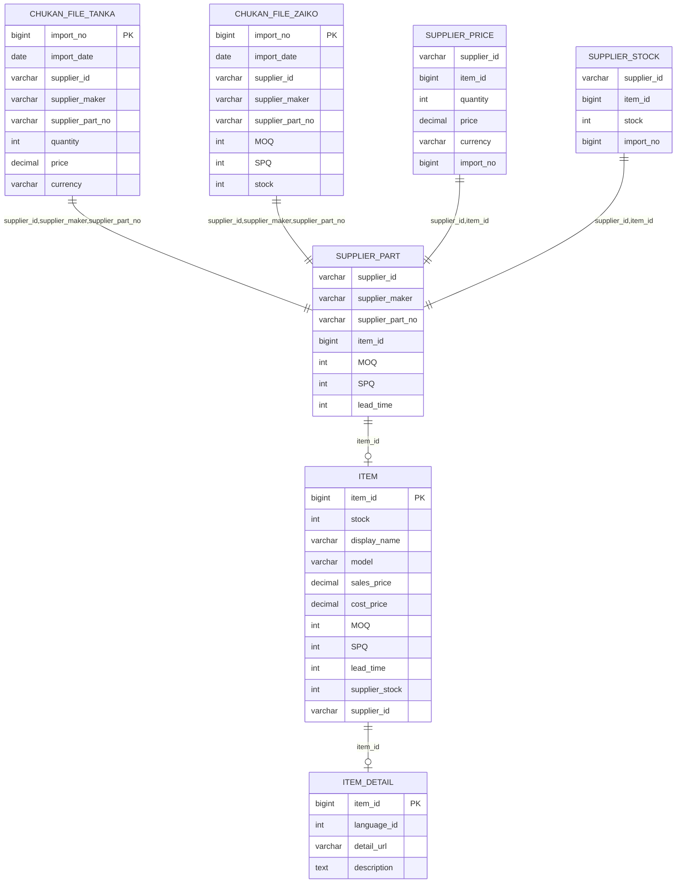
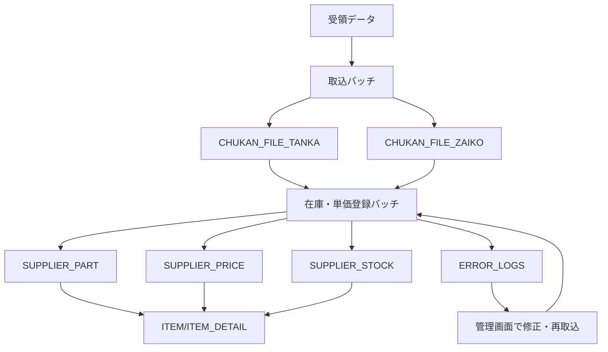

# システムギア様向けECサイト機能拡張 STEP1 詳細設計書

---

## 1. 概要
- 本書はSTEP1（外部在庫取込の基本機能）の詳細設計をまとめたものです。
- 対象範囲：データ受領、マッピング、バッチ処理、DB反映、エラー管理、基本画面・API

---

## 2. 画面詳細設計

### 2.1. ログイン画面
- 管理者/担当者認証（JWT認証）
- パスワードリセット（メール送信）

### 2.2. ダッシュボード
- 取込状況サマリ（最新バッチ状況、エラー件数、仕入先別状況）
- アラート・通知表示

### 2.3. 商品検索・一覧
- 検索条件：商品名、型番、仕入先、在庫、価格
- 検索結果：商品ID、型番、名称、在庫、価格、仕入先、詳細リンク
- ページング・ソート・CSV出力

### 2.4. 取込データ管理
- 取込履歴一覧（バッチNo、仕入先、取込日時、件数、エラー数）
- 取込ファイルダウンロード、詳細（エラー内容、再取込ボタン）

### 2.5. エラー管理・修正
- エラー一覧（項目別、仕入先別、エラー内容）
- エラー内容編集・修正・再取込

### 2.6. マッピング設定
- 仕入先ごとにマッピングルール設定・編集
- 項目名、型、変換条件、一致条件、固定値、バリデーション
- サンプルデータプレビュー、インポート/エクスポート

---

## 3. API詳細設計

### 3.1. 商品一覧取得
- GET /api/products
- パラメータ：name, model, supplier, page, size
- レスポンス：total, items[{id, model, name, stock, price, supplier}]

### 3.2. マッピングルール取得・登録
- GET /api/mapping-rules?supplier=xxx
- POST /api/mapping-rules
- パラメータ：supplier, rules[{file_field, db_field, type, condition, fixed_value}]

### 3.3. 取込データバッチ実行
- POST /api/external-stock/import
- multipart/form-data（ファイル＋supplier）
- レスポンス：result, import_id

### 3.4. エラー一覧取得
- GET /api/external-stock/errors?import_id=xxx
- レスポンス：[{row, field, error}]

---

## 4. バッチ・マッピングロジック詳細（補足・強化）

### 4.1. 受領データ取込バッチ
- 取込ファイルを元に中間テーブル（external_stock_staging等）へ登録
- 各仕入先ごとの異なるフォーマット・連携項目を統一フォーマットの中間テーブルに変換
- 登録はマッピングルールの条件に従う
- 取込単位で「取込管理No.」を自動採番
- 仕入先ごとの提供時間に合わせてスケジュール起動（定期バッチ・常駐バッチ）
- 受領直後から手動エラー修正が可能

### 4.2. 在庫・単価データ登録バッチ
- 中間テーブルを元に、仕入先型番・在庫・単価テーブル（external_stock_master等）へ登録・更新
- 登録はマッピングルールの条件に従う
- 仕入先型番・在庫データの登録は在庫データ登録バッチで行う
- 仕入先品目データの初回登録時は「社内品目ID」は未付与
- 社内品目ID割り付け済み商品のみ、仕入先在庫・単価テーブルへ本登録・更新
- 社内品目ID未付与商品は別テーブルで保持し、後日手動修正・再取込
- データ登録時は「取込管理No.」をキーに過去データを削除（新規データのみ残す）
- バッチは時間で繰り返し実施（常駐バッチ運用）

---

## 5. DBスキーマ詳細（抜粋）

### 5.1. external_stock_staging
| カラム名         | 型         | 説明               |
|------------------|------------|--------------------|
| id               | bigint     | PK                 |
| import_no        | bigint     | 取込管理No         |
| supplier         | varchar(64)| 仕入先名           |
| file_field_1...N | varchar    | 受領ファイル項目   |
| created_at       | timestamp  | 取込日時           |

### 5.2. external_stock_master
| カラム名         | 型         | 説明               |
|------------------|------------|--------------------|
| id               | bigint     | PK                 |
| supplier         | varchar(64)| 仕入先名           |
| part_no          | varchar(64)| 仕入先型番         |
| products_id      | bigint     | 自社品目ID         |
| stock            | int        | 在庫数             |
| price            | decimal    | 単価               |
| moq              | int        | 最小発注数量       |
| spq              | int        | 最小パッケージ数   |
| lead_time        | int        | 納期               |
| updated_at       | timestamp  | 更新日時           |

### 5.3. mapping_rules
| カラム名         | 型         | 説明               |
|------------------|------------|--------------------|
| id               | bigint     | PK                 |
| supplier         | varchar(64)| 仕入先名           |
| file_field       | varchar(64)| 取込ファイル項目   |
| db_field         | varchar(64)| 自社DB項目         |
| type             | varchar(16)| 型変換             |
| condition        | varchar(64)| 一致条件           |
| fixed_value      | varchar(64)| 固定値             |
| priority         | int        | 優先度             |
| created_at       | timestamp  | 登録日時           |

### 5.4. error_logs
| カラム名         | 型         | 説明               |
|------------------|------------|--------------------|
| id               | bigint     | PK                 |
| import_no        | bigint     | 取込管理No         |
| row_no           | int        | エラー行           |
| field            | varchar(64)| エラー項目         |
| error_message    | text       | エラー内容         |
| created_at       | timestamp  | 記録日時           |

---

## 6. 運用フロー詳細
1. 管理者が仕入先・マッピングルールを設定
2. 仕入先からデータ受領（メール/SFTP/手動）
3. 取込バッチ実行→中間テーブル登録
4. マッピング処理→本番DB反映
5. エラー発生時は管理画面で修正・再取込
6. 商品情報はECサイトに自動反映

---

## 7. 補足
- 画面・API・バッチ・DB設計は全てSTEP1要件に整合
- 詳細な画面デザインやAPI仕様書（Swagger等）は別途作成可能 

---

## 8. 詳細処理フロー定義（補足・強化）

### 8.1. データ受領（データ入力）
- 様々なソース（仕入先ごとのCSV/Excel/システム連携等）からデータを受領
- データ種別：中間在庫データ、中間単価データ
- 受領方法：メール添付、SFTP、Webアップロード等
- 受領後、ファイルは一時ストレージに保存
- 受領直後から手動でエラー修正が可能（例：明らかなフォーマット不備、必須項目欠落など）
- 取込管理No.を自動採番し、各バッチ処理のトラッキングに利用
- 仕入先ごとの提供タイミングに合わせてスケジュール起動

### 8.2. 一次処理（データ取込バッチ）
- 受領データをパースし、中間在庫テーブル・中間単価テーブルに格納
- マッピングルールに従い、各仕入先データを自社中間テーブル項目に変換
- 一次処理段階でのエラー（型不一致、必須項目欠落、値範囲外等）はエラーテーブルに記録
- エラーは管理画面から手動修正・再取込が可能
- 取込管理No.単位で中間テーブルに登録
- マッピング条件適用
- エラーは管理画面から手動修正・再取込

### 8.3. 二次処理（在庫データ登録バッチ）
- 一次処理済みの中間在庫データを本番在庫テーブルに登録
- 在庫データの整合性チェック（例：同一品目の重複、在庫数のマイナス値等）
- 二次処理段階でもエラーが発生した場合はエラーテーブルに記録し、手動修正・再取込が可能
- 社内品目ID未付与商品は本登録せず、別管理テーブルで保持
- 社内品目ID付与後に再取込・本登録
- 取込管理No.で過去データを削除し、最新データのみ残す

### 8.4. 製品データおよび在庫統合
- 製品データ（品目マスタ等）をシステムにマッピング・登録
- 在庫データと製品データを品目ID等で統合
- 統合時に不整合（例：在庫データに存在するが製品マスタに未登録等）があればエラー記録・手動修正
- 統合後、製品ごとの在庫・価格・納期等を一元管理
- 在庫データと製品データの統合時も、社内品目IDの有無で処理分岐

### 8.5. 最終出力および表示
- 統合済みの製品・在庫データをECサイト（ショッピングサイト）に反映
- 顧客向けに商品一覧・詳細・在庫・価格情報を表示
- 表示前に最終バリデーション（非公開フラグ、販売停止品除外等）
- 顧客インタラクション（検索、カート投入、注文等）に連携
- 常駐バッチで定期的に最新データを反映

---

### 【補足】
- 各段階でエラーが発生した場合、管理画面から手動修正・再取込が可能
- エラー内容・修正履歴は全てエラーテーブル・ログに記録
- マッピングルールは各段階で適用され、運用中も随時追加・修正可能
- 将来的な自動化・AI補助も拡張性として考慮 

---

## 9. データ構成ER図



---

## 10. DDL（テーブル定義書・SQL例）

### 10.1. 中間ファイル単価（CHUKAN_FILE_TANKA）
```sql
CREATE TABLE CHUKAN_FILE_TANKA (
  import_no      BIGINT NOT NULL,
  import_date    DATE NOT NULL,
  supplier_id    VARCHAR(64) NOT NULL,
  supplier_maker VARCHAR(128),
  supplier_part_no VARCHAR(128) NOT NULL,
  quantity       INT,
  price          DECIMAL(15,4),
  currency       VARCHAR(8),
  PRIMARY KEY (import_no, supplier_id, supplier_part_no)
);
```

### 10.2. 中間ファイル在庫（CHUKAN_FILE_ZAIKO）
```sql
CREATE TABLE CHUKAN_FILE_ZAIKO (
  import_no      BIGINT NOT NULL,
  import_date    DATE NOT NULL,
  supplier_id    VARCHAR(64) NOT NULL,
  supplier_maker VARCHAR(128),
  supplier_part_no VARCHAR(128) NOT NULL,
  MOQ            INT,
  SPQ            INT,
  stock          INT,
  PRIMARY KEY (import_no, supplier_id, supplier_part_no)
);
```

### 10.3. 仕入先型番（SUPPLIER_PART）
```sql
CREATE TABLE SUPPLIER_PART (
  supplier_id      VARCHAR(64) NOT NULL,
  supplier_maker   VARCHAR(128),
  supplier_part_no VARCHAR(128) NOT NULL,
  item_id          BIGINT,
  MOQ              INT,
  SPQ              INT,
  lead_time        INT,
  PRIMARY KEY (supplier_id, supplier_part_no)
);
```

### 10.4. 仕入先単価（SUPPLIER_PRICE）
```sql
CREATE TABLE SUPPLIER_PRICE (
  supplier_id   VARCHAR(64) NOT NULL,
  item_id       BIGINT NOT NULL,
  quantity      INT,
  price         DECIMAL(15,4),
  currency      VARCHAR(8),
  import_no     BIGINT NOT NULL,
  PRIMARY KEY (supplier_id, item_id, import_no)
);
```

### 10.5. 仕入先在庫（SUPPLIER_STOCK）
```sql
CREATE TABLE SUPPLIER_STOCK (
  supplier_id   VARCHAR(64) NOT NULL,
  item_id       BIGINT NOT NULL,
  stock         INT,
  import_no     BIGINT NOT NULL,
  PRIMARY KEY (supplier_id, item_id, import_no)
);
```

### 10.6. 品目（ITEM）
```sql
CREATE TABLE ITEM (
  item_id         BIGINT PRIMARY KEY,
  stock           INT,
  display_name    VARCHAR(128),
  model           VARCHAR(128),
  sales_price     DECIMAL(15,4),
  cost_price      DECIMAL(15,4),
  MOQ             INT,
  SPQ             INT,
  lead_time       INT,
  supplier_stock  INT,
  supplier_id     VARCHAR(64)
);
```

### 10.7. 品目詳細（ITEM_DETAIL）
```sql
CREATE TABLE ITEM_DETAIL (
  item_id         BIGINT NOT NULL,
  language_id     INT NOT NULL,
  detail_url      VARCHAR(255),
  description     TEXT,
  PRIMARY KEY (item_id, language_id),
  FOREIGN KEY (item_id) REFERENCES ITEM(item_id)
);
``` 

---

## 11. バッチ処理・データフロー擬似コード

### 11.1. 受領データ取込バッチ（Pseudocode）
```
for each received_file in input_files:
    parse received_file
    for each row in received_file:
        if validate(row):
            insert into CHUKAN_FILE_TANKA or CHUKAN_FILE_ZAIKO (by file type)
        else:
            log error to ERROR_LOGS
    assign import_no to all rows in this batch
    schedule next batch by supplier's delivery time
```

### 11.2. 在庫・単価データ登録バッチ（Pseudocode）
```
for each import_no in CHUKAN_FILE_TANKA/CHUKAN_FILE_ZAIKO:
    for each row in import batch:
        if mapping to SUPPLIER_PART exists:
            if item_id is assigned:
                upsert SUPPLIER_PRICE or SUPPLIER_STOCK
            else:
                store in pending table for manual item_id assignment
        else:
            log error to ERROR_LOGS
    delete old SUPPLIER_PRICE/SUPPLIER_STOCK by import_no (keep only latest)
```

### 11.3. エラー処理・再取込フロー
- エラー発生時はERROR_LOGSに記録
- 管理画面で手動修正・再取込可能
- item_id未付与データはpendingテーブルで管理、item_id付与後に再バッチ

### 11.4. データフロー図（簡易）


---

## 12. 実装計画・スケジュール案

### 12.1. 実装工程
1. 詳細設計（画面・API・DB・バッチ）
2. DB構築・マイグレーション
3. バッチ処理・API開発
4. 画面（管理UI・商品一覧等）開発
5. 単体テスト
6. 結合テスト
7. UAT（受入テスト）
8. リリース準備・本番反映
9. 運用・保守

### 12.2. マイルストーン例
| フェーズ         | 期間（例） | 主な成果物・作業内容                |
|------------------|------------|-------------------------------------|
| 詳細設計         | 1週間      | 詳細設計書、ER図、DDL、画面仕様      |
| DB構築           | 1週間      | テーブル作成、初期データ投入        |
| バッチ/API開発   | 2週間      | バッチ処理・API実装、単体テスト     |
| 画面開発         | 2週間      | 管理画面・商品一覧等の実装          |
| 結合・受入テスト | 1週間      | 結合テスト、UAT、修正               |
| リリース         | 1週間      | 本番反映、運用引継ぎ                |

### 12.3. 体制・役割分担（例）
- PM（プロジェクト管理）
- SE（設計・レビュー）
- PG（開発：バッチ・API・画面）
- テスター（テスト計画・実施）
- インフラ担当（DB・サーバ構築）

### 12.4. 補足
- 上記はSTEP1（外部在庫取込の基本機能）のみの想定
- 実際の規模・要件により調整
- 並行して運用マニュアル・教育資料も作成推奨 

---

## 13. テスト設計（観点・ケース例）

### 13.1. テスト観点
- 画面操作（正常系・異常系）
- バッチ処理（正常系・異常系・エラー再取込）
- マッピングルール適用・変更
- DB登録・更新・削除の正確性
- エラー発生時のログ・通知
- 取込管理No.運用・過去データ削除
- 権限・認証（管理者/一般ユーザー）

### 13.2. テストケース例
| No | 項目 | 入力 | 期待結果 |
|----|------|------|----------|
| 1  | 取込ファイル正常 | 正常CSV | 中間テーブルに正しく登録される |
| 2  | 取込ファイル異常 | 必須項目欠落 | エラーとしてログ・画面表示 |
| 3  | マッピングルール変更 | ルール追加 | 反映後のデータが正しく変換される |
| 4  | 在庫・単価バッチ | 正常データ | SUPPLIER_STOCK/PRICEに登録 |
| 5  | item_id未付与 | item_id空 | pendingテーブルに保持される |
| 6  | エラー修正・再取込 | エラー修正後再実行 | 正常登録される |
| 7  | 取込管理No.運用 | 2回目以降の取込 | 過去データが削除され最新のみ残る |
| 8  | 権限チェック | 一般ユーザーで管理画面操作 | 権限エラーとなる |

---

## 14. 運用設計（監視・障害対応・マニュアル案）

### 14.1. 監視・アラート
- バッチ処理の成否・遅延監視（監視ツール/メール通知）
- エラー発生時の自動通知（管理者宛）
- DB容量・パフォーマンス監視

### 14.2. 障害対応
- エラー内容・履歴はERROR_LOGS/管理画面で確認
- 再取込・手動修正フローを明確化
- バックアップ・リストア手順整備
- 障害時の連絡体制（管理者・開発ベンダー）

### 14.3. 運用マニュアル案
- 取込ファイル受領・アップロード手順
- エラー修正・再取込手順
- マッピングルール追加・変更手順
- バッチ・システム再起動手順
- 問い合わせ・障害時の連絡先一覧 